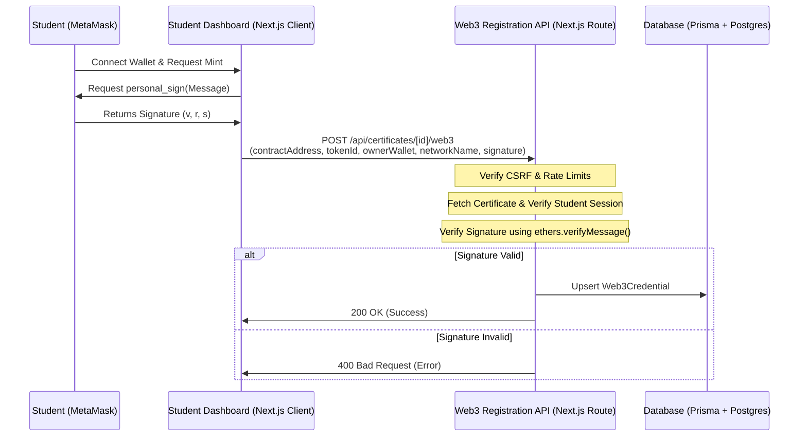
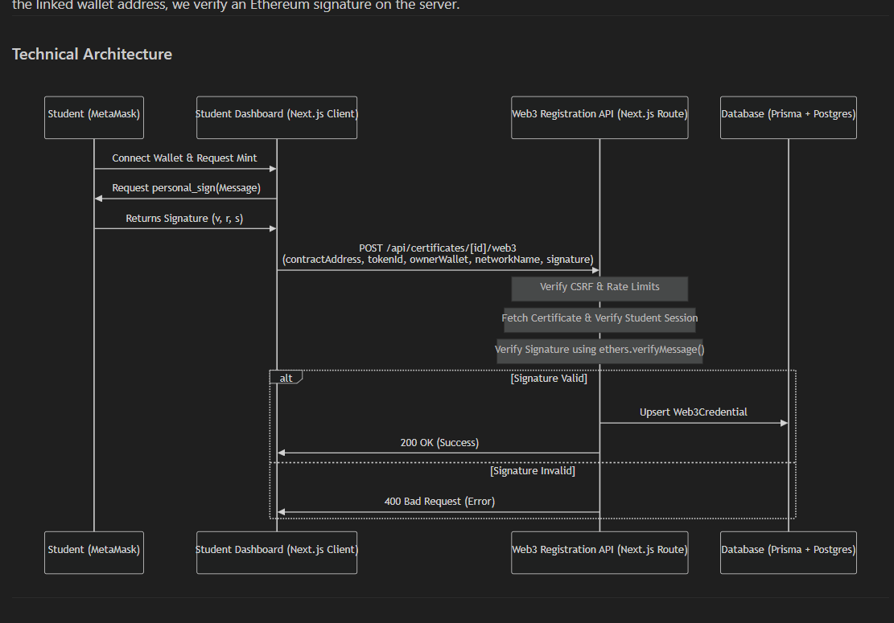

# Implementation Plan – Web3 Soulbound NFT & Cryptographic Wallet Verification

This plan adds a secure Web3 Soulbound NFT credential system. To prevent spoofing and ensure that the certificate owner actually controls the linked wallet address, we verify an Ethereum signature on the server.

---

## Technical Architecture

---

## Proposed Changes

We will make the following extensions:

### 1. Install Ethers Package
* Run `npm install ethers` to enable lightweight Ethereum cryptographic signature recovery on the server.

### 2. Secure Web3 Registration Endpoint
#### [NEW] [route.ts](file:///c:/Users/FARAZ%20KHAN/Desktop/DEKSTOP/Finalcartificates/app/api/certificates/%5Bid%5D/web3/route.ts)
* Create `POST /api/certificates/[id]/web3` to record the NFT.
* **Authentication**: Check that the session role is `STUDENT` and their email matches the certificate's recipient student email.
* **Cryptographic Signature Verification**:
  * Reconstruct the message signed by the user: `I verify ownership of my certificate. Credential ID: ${certificateId}. Owner Wallet: ${ownerWallet}.`
  * Use `ethers.verifyMessage()` to recover the signer's address from the signature.
  * Fail with `400 Bad Request` if the recovered address does not match `ownerWallet` (proving the user does not own the wallet's private key).
* **Rate Limiting & CSRF**: Inherit automatic CSRF validation from proxy middleware and apply a strict 15-request-per-minute rate limit.

### 3. Student Dashboard Interactive Minting UI
#### [MODIFY] [page.tsx](file:///c:/Users/FARAZ%20KHAN/Desktop/DEKSTOP/Finalcartificates/app/dashboard/student/certificates/page.tsx)
* Update the prisma include block to fetch the `web3Credential` relation.
* Render the minting action triggers.
#### [NEW] [MintNftButton.tsx](file:///c:/Users/FARAZ%20KHAN/Desktop/DEKSTOP/Finalcartificates/components/dashboard/MintNftButton.tsx)
* Client component that handles MetaMask connection and triggers `window.ethereum.request({ method: 'personal_sign', params: [msg, address] })`.
* Upon signature generation, POSTs the signature and parameters to the secure backend endpoint. On success, refreshes the page content.

### 4. Verification Page Web3 Audit Card
#### [MODIFY] [page.tsx](file:///c:/Users/FARAZ%20KHAN/Desktop/DEKSTOP/Finalcartificates/app/%28public%29/verify/%5BcertificateId%5D/page.tsx)
* Include `web3Credential` in the database fetch block.
* Render a new **Soulbound Token Verification Card** inside the page if the certificate has been minted, showing the public ledger details (Contract, Token ID, Owner Address, and Network) with direct links to Polygonscan.

---

## Verification Plan

### Automated Build Check
- Run `npm install ethers`.
- Run `npm run build` to verify compilation.

### Manual Verification
- Log in as a student, connect wallet, sign the secure message via MetaMask, and verify it updates to "Minted on Polygon".
- Try sending a spoofed/modified signature to the API and verify that the backend rejects it with a cryptographic verification error.
